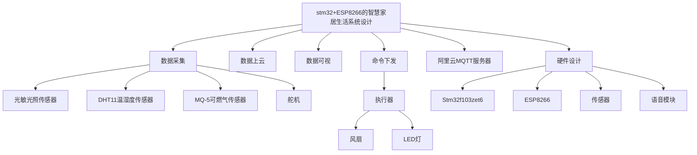

# stm32+ESP8266的智慧语音家居生活系统的设计

## 项目所需的材料
- **主控芯片**：stm32f103zet6

## 项目的功能模块选择
- **SG90**：
- **HC-SR04**：
- **ESP8266-01S**：
- **GY-302**：
- **MQ-5**：
- **温湿度传感器**：
- **风扇模块**：
- **光敏电阻**：

（以上器材皆为学校实验室）

- **信泰微ASR-PRO语音模块**：  
  购买链接：[淘宝链接](https://detail.tmall.com/item.htm?id=693060856818&ns=1&priceTId=213e030c17403200954421683ef14b&skuId=5093606658682&spm=a21n57.1.hoverItem.1&utparam=%7B%22aplus_abtest%22%3A%2219f843913bce914f711510f410824c4f%22%7D&xxc=ad_ztc) 或淘宝搜索

## 项目的功能框架
基于stm32标准库，连接阿里云平台的智能家居控制系统设计与实现。通过ESP8266发送AT指令连接阿里云，订阅和发布单片机数据。

### 功能描述
1. **设备端功能**  
   - 实时采集温湿度、距离（超声波模块）、舵机、光敏电阻、光照强度。  
   - 通过MQTT协议以CJSON格式发送到云平台。  
   - 单片机可自行调整温度过高时，蜂鸣器响，风扇转动。  
   - 根据光照自动拉窗帘等操作。

2. **云平台功能**  
   - 在云平台网页端可以远程查看数据。  
   - 在Android APP上查看实时数据。  
   - 通过APP控制家庭中的设备。

3. **语音模块功能**  
   - 可控制单片机执行各项指令（开灯、关灯、开窗、关窗等）。

### 系统架构图

